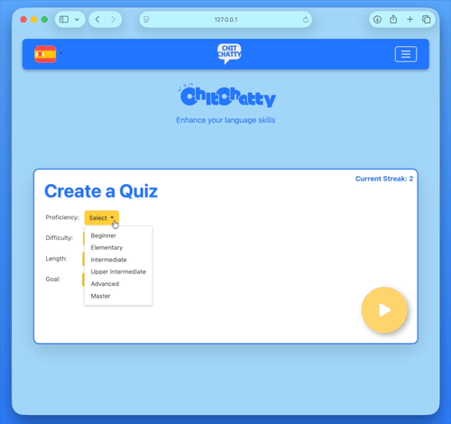

# Chit-Chatty

##### Created by Darion Badillo, Andrew Douangprachanh, Irving Reyes Bravo, Naomi Rodriguez, and Christopher Romo
##### CS 4300 Advanced Software Engineering : Group 5 : Fall 2024

---

**Chit-Chatty** is a language learning application designed to help users improve their language skills through dynamically-generated quizzes and pre-made lessons. The app uses the OpenAI API and user input to create custom quizzes. "Word of the Day" and daily lessons encourage continuous learning. Multiple languages are supported for the quizzes, "Word of the Day", and daily lessons. The app aims to provide an engaging and personalized learning experience by catering the learning material to your preferences.

## Technologies 💻

   - Django (Python)
   - OpenAI API
   - HTML
   - CSS
   - JavaScript

## Features 📄

   - **User Authentication:** Users can create accounts, login and logout, access specific features reserved for account holders, and see their account information.

   - **Quiz Generation:** Quizzes are generated through internal prompts using OpenAI API. Users can customize their quiz with options such as difficulty, proficiency, length of quiz, etc.

   - **Quiz Management:** User progress is tracked throughout the duration of the quiz, allowing for users to stop and restart the quiz without losing progress.

   - **Quiz Recap:** At the end of the quiz, the user is given a summary of their results, that being the amount of correct and incorrect answers along with messages based on the score.

   - **Word of the Day:** Single word daily quiz based on the selected language.

   - **Daily Lesson:** Lessons based on a theme that cycle out daily. It consists of cards composed of an image and a description in the selected language.

## Reflection 💭

**The Process:** This project was created by a team of 5 for our advanced software engineering class. We started by learning how to work as group, which mainly consisted of setup and learning project management tools. For this project, we used DevEdu as our cloud development environment, a shared Git repository, Zenhub as our project board, Kritik for assessment of our teammates, and Discord for team communication. We followed the Agile Methodology, building the app over 4 2-week sprints. We found a flow for our sprints, starting with delegation of tasks from the project board. Design came next, where we would meet up and share ideas for how new features would look and interact with existing features. After that, we would build solutions by making personal branches, dealing with merge conflicts, and creating pull requests once finished. During development, we documented our changes and additions, and at the end we grouped these together to create a changelog.

**Key Takeaways:** Over the course of the semester, we learned many things about software engineering. Concepts like the Agile Methodology and Continuous Integration shaped how we worked on the application. Project management tools like Zenhub (Project Board) and Git/GitHub helped us to organize our project and plan for new features. We had to learn how to work as a team, and we did this by frequent communication through Discord, in-person meetings, assessment of our teammates through Kritik to ensure equal contribution, and choosing a project leader for each sprint to lead the group. With Django chosen as our framework, we learned a lot about the MVT architecture and Python in general. We also touched on HTML, CSS, and JavaScript for the creation of the templates. We worked with another team who acted as "the customers", and we had to ensure we were delivering key features. Overall, we learned software engineering encapsulates a lot of concepts, including project management, design, implementation, documentation, communication, and much more.

## Running the Project 🎬

1. Clone the repository.

2. Ensure Python (3.10+) is installed on your computer.
   
3. Hook up OpenAI API key:
   1. Create a .env file in the `chit-chatty/chitchatty/` directory.
   2. On the first line, add "OPENAI_API_KEY=yourkeyhere", replacing the "yourkeyhere" with your key.

4. Open a terminal in the `chit-chatty` directory.
         
5. Create a virtual environment:
   ```bash
   python -m venv venv
   source venv/bin/activate
   ```

6. Install dependencies:
   ```bash
   pip install -r requirements.txt
   ```

7. Run migrations:
   ```bash
   cd chitchatty
   python manage.py migrate
   ```

8. Run the server:
   ```bash
   python manage.py runserver
   ```

9. Access the app at `http://127.0.0.1:8000`.

## Quick Look 🎥

<p align="center">
  
</p>

---

# ٩( ᐛ)و
